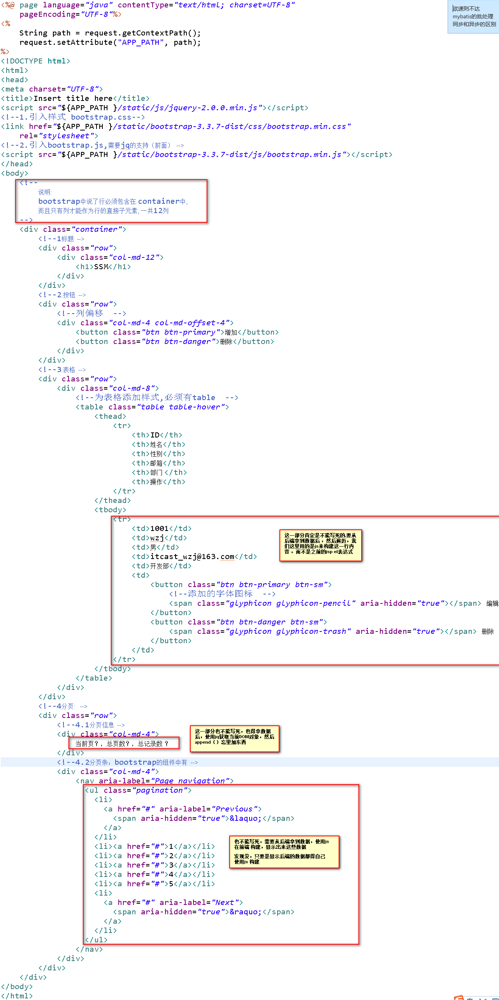
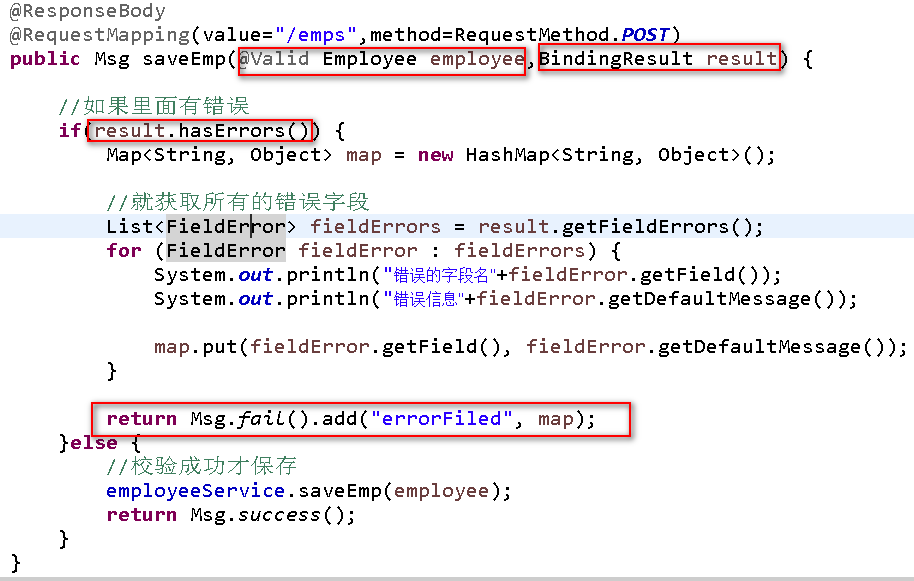

# SSM_CRUD

## 一、搭建环境

**案例结构图**


### 1.1、创建一个simple的maven项目


### 1.2、导入所需的依赖


**使用依赖的时候出现过问题**

```java
1.问题描述:
博客：https://blog.csdn.net/weixangyu2012/article/details/73991995
我在pom.xml文件中引入了一些依赖，而这些依赖也下载到了我的本地仓库（我去看了）
但是却在项目上和pom.xml上报了个红叉,然后打开problems视图，说Misssing....jar
就是找不到jar包，我明明有啊，然后我update maven 也没有用，最终cmd 进入到项目下面
mvn clear install , 然后去update maven就好了

2.注意也可以在maven仓库的settings.xml文件中,设置镜像 和  jdk的编译！！！防止一些莫名其妙的问题出现
```


### 1.3、前端需要的bootStrap和jq


### 1.4、然后SSM整合

**只看一个之前没接触过的**


**其他这里就不贴图了，代码里面的注释我写的很详细**

参考这个顺序

- web.xml （启动spring  和 springmvc）

- applicationContext.xml （spring配置文件）

- mybatis-config.xml  （mybatis配置文件）

  **mybatis 中 没提示的解决**：<https://blog.csdn.net/qq_32016019/article/details/78684233>

- dispatcherServlet-servlet.xml（其实就是springmvc的配置,在web-inf下）


### 1.5、创建表


### 1.6、根据表生成bean,映射文件,Mapper接口(Mybatis的逆向工程)

#### 1.6.1、导入逆向工程的jar

```xml
<!-- https://mvnrepository.com/artifact/org.mybatis.generator/mybatis-generator-core -->
<dependency>
    <groupId>org.mybatis.generator</groupId>
    <artifactId>mybatis-generator-core</artifactId>
    <version>1.3.5</version>
</dependency>
```

#### 1.6.2、去官网找到逆向生成的 xml配置

**注意：配置文件是放在项目下面而不是src下面！！！**

**地址：https://github.com/mybatis/generator**


#### 1.6.3、运行，然后刷新项目


#### 1.6.4、然后测试阶段

**测试dao层与数据库连接通没通**


## 二、编写分页（pageHelper插件）

### 2.0、分页的一些名词

```java
1.当前页 pageNum 
2.总页数：pages
3.总记录数: total
4.每页记录数: pageSize 业务数据(由客户来决定)

总记录是100条
每页记录数是10条
求有多少页？ 10页
总页数 = 总记录数/每页记录数
```

**PageInfo类中的字段也有注释说明！！！！**

- 比如所有导航页码：**navigatepageNums**
- 是否有前一页：**hasPreviousPage**
- 是否有后一页：**hasNextPage**

### 2.1、插件地址

**文档中有说明具体如何使用**

**github文档：https://github.com/pagehelper/Mybatis-PageHelper**

### 2.2、使用步骤

- **导入依赖包**

```xml
<dependency>
    <groupId>com.github.pagehelper</groupId>
    <artifactId>pagehelper</artifactId>
    <version>5.0.0</version>
</dependency>
```

- **然后在mybatis全局配置中配置 或者 在spring中的sqlSession下配置**

```xml
<plugins>
    <plugin interceptor="com.github.pagehelper.PageInterceptor"></plugin>
</plugins>
```

- **在Controller层使用的代码**


**pageInfo这个类里面封装了所有跟分页的属性**


### 2.3、使用mvcMock测试请求

```java
@WebAppConfiguration
@RunWith(SpringJUnit4ClassRunner.class)
//记得用Mock测试，还要导入springmvc的配置文件
@ContextConfiguration(locations= {"classpath:applicationContext.xml","file:src/main/webapp/WEB-INF/dispatcherServlet-servlet.xml"})
public class PageInfoMockTest {
	
	//传入springmvc的ioc
	@Autowired //@AutoWired其实只能注入容器中的bean, 而注入springmvc容器本身需要用@WebApplicationConfigura
	WebApplicationContext context;
	
	//虚拟mvc请求，获取处理结果
	MockMvc mockMvc;
	
	@Before
	public void init() {
		mockMvc = MockMvcBuilders.webAppContextSetup(context).build();
	}
	
	@Test
	public void testPage() throws Exception {
		//模拟请求拿到返回值
		MvcResult result = mockMvc.perform(MockMvcRequestBuilders.get("/emps").param("pageNum", "1")).andReturn();
		
		//请求成功后，请求域中会有pageInfo,我们可以取出pageInfo进行验证 
		MockHttpServletRequest request = result.getRequest();
		PageInfo pageInfo = (PageInfo) request.getAttribute("pageInfo");
		System.out.println("当前页码："+pageInfo.getPageNum());
		System.out.println("总页码："+pageInfo.getPages());
		System.out.println("总记录数："+pageInfo.getTotal());
		System.out.println("在页面需要连续显示的页码");
		int[] nums = pageInfo.getNavigatepageNums();
		for (int i : nums) {
			System.out.print(" "+i);
		}
		System.out.println();
		
		//获取员工数据
		List<Employee> list = pageInfo.getList();
		for (Employee emp : list) {
			System.out.println("员工id: "+emp.getEmpId()+"\t员工姓名："+emp.getEmpName());
		}
	}
```


### 2.4、搭建bootStrap分页页面（这是使用el的方式，但是不推荐）

主要是使用**全局css中的 删格系统（一行一共分为12列）  和  组件中的分页**


## 三、前端阶段

### 3.1、划分布局 

- 使用bootStrap的删除系统

- 分成四行,第一行是标题，第二行放按钮，第三行放表格，第四行放分页的信息

  

**显示出来的效果** 


**总结：需要显示后台数据的都得在前端使用jq构建出来显示**

#### 3.1.1 使用jq构建表格


**上面的按钮就是这样,总结写代码一定要规范！！！**


**后面发生的好几个重复都是闭合标签没弄好，导致的，出去吃了个饭就立马解决了 哈哈哈 ，代码得规范啊**

**刚开始看到错误一脸懵逼，还以为是点击之前没清空样式，后来发现根本没点击就是这样了**


#### 3.1.2、使用jq构建分页信息


#### 3.1.3、使用jq构建分页条

- 只是原型代码，并没有什么功能

```javascript
//构建分页条信息
	function build_page_bar(result){
		console.log(result);
		
		//由内向外创建,先创建li,再 创建ul等等
		var ul = $("<ul></ul>").addClass("pagination");
		//首页
		var firstPage = $("<li></li>").append("<a>首页</a>");
		//上一页
		var prePage = $("<li></li>").append($("<a></a>").append("<span>&laquo;</span>"));
		
		ul.append(firstPage).append(prePage);
		
		//中间有个导航页号,需要从pageInfo中拿出来遍历
		$.each(result.extend.pageInfo.navigatepageNums,function(index,num){
			var navLi = $("<li></li>").append($("<a></a>").append(num));
			ul.append(navLi);
		}); 
		
		//下一页
		 var nextPage = $("<li></li>").append($("<a></a>").append("<span>&raquo;</span>"));
		
		//尾页
		var lastPage = $("<li></li>").append("<a>尾页</a>");
		
		ul.append(nextPage).append(lastPage); 
		
		ul.appendTo("#nav_list");
		
	}
```


**使用链接发送和ajax发送的区别 , 我这里用首页和末页做了下对比**

```javascript
// 这是使用ajax请求的形式
var firstPage = $("<li></li>").append("<a>首页</a>");
		//为首页添加点击事件,然后发送一个ajax请求,pageNum=1,这个时候就要把之前的代码给抽取下
		firstPage.click(function(){
			$.ajax({
				url:"${APP_PATH}/emps",
				data:"pageNum=1",
				type:"GET",
				success:function(result){
                    //不然这里拿到还得1.构建表格 2.构建分页这些，所以这里跟之前相同的部分要抽取成函数
                    //要不然写死去
					console.log(result);
				}
			});
		});

//这是使用链接请求的形式
//尾页,用链接的话,把鼠标方上去的话,会看到请求的地址,而且返回的话,整个页面都是json数据,而用ajax这种方式就看不到
var lastPage = $("<li></li>").append($("<a>尾页</a>").attr("href","${APP_PATH}/emps?pageNum="+pageInfo.pages));
```

- **每发送一个请求；都会叠加一次样式的问题；如图所示**


- **所以每次发送请求之前，清除其他的样式**

```javascript
1.把表格体中的清除 
 $("#emp_table tbody").empty();
2.把分页信息区域的样式清除
$("#page_info").empty();
3.把分页条区域里面nav的样式清除,否则如果直接清除page_bar的话,第一次是不会有分页条的,
$("#nav_list").empty();
```

- **遇到的坑**

今天我访问我写的这个项目 http:localhost:8080/SSM_CRUD/emps?pageNum=?

都可以返回数据, 无论pageNum等于几 ；都可以返回对应的json数据；表格里面的内容 和

分页信息都可以动态改变；唯独分页条这里不动总是12345，我点5，他会不会变成 34567

反正点导航页都不会 变；但ajax请求是发出去了的，数据也是拿回来也是理想状态的；

我以为是逻辑问题；我就一步步看；但发现也没啥问题；就当我想clean项目的时候；

突然发现项目居然没启动 ；那为什么我发请求都可以拿数据呢；而且还可以动态的拿

没有其他办法；只能感觉是缓存了；后来发现 也不是缓存；因为我shutdown.bat

又访问不了 了，然后狗血的是样式叠加的问题，其实是跳了的；但是被我的F12给挡住了；

总之 ；我只想说一句；什么仇啊；每次这种问题被我遇到；


- **在mybatis中配置**
```xml
<plugins>
 		<plugin interceptor="com.github.pagehelper.PageInterceptor">
 			<!--分页参数合理化
 				当该参数设置为 true 时，pageNum<=0 时会查询第一页，
 				pageNum>pages（超过总数时），会查询最后一页
 			  -->
 			<property name="reasonable" value="true"/>
 		</plugin>
 	</plugins>
```


### 3.2模态框的部分（添加员工和校验部分内容）

#### 3.2.1**在点击增加之前发一个ajax请求获取部门信息**

```:eight:
function getDepts(){
		$.ajax({
			url:"${APP_PATH}/depts",
			type:"GET",
			success:function(result){
				//这里注意depts是一个集合,得先遍历!!! 不遍历直接取里面的属性是取不到的！！！
				var depts = result.extend.depts;
				$.each(depts,function(index,dept){
					$("<option value="+dept.deptId+">"+dept.deptName+"		</option>").appendTo("#deptName_select");
				});
			}
		});
	}
```

**这里注意depts是一个集合,得先遍历!!! 不遍历直接取里面的属性是取不到的！！！ 之前犯过的错**


#### 3.2.2 校验阶段

- 有用户输入格式校验
- 有发送ajax判断用户名是否重复的 校验
- 还有校验的样式的问题 

弹出模态框； 点击里面的添加按钮之前得先 符合要求；才去发送ajax添加

点击按钮保存员工之前：1. 校验格式 2.ajax判断用户名是否重复(是放在外面的)** 


**场景一：**！！！！

**

**之前发生过这样的情况：就是你用户名校验重复的时候；假如这个用户名可用；提示你可用**

**然后等到前端格式校验的时候；又说不符合规则；用户会一脸懵逼； 体验感 贼差；**

```:eight:
**要解决这个问题；就是发送ajax去数据库校验用户名之前(在controller层或者service层)**

**对用户名进行后端的校验；如果不符合规则；就提示跟前端校验一样的错误提示；**

**否则才去数据库校验**

```


**场景二：**

**之前使用ajax校验用户名是否重复；重复了也只是给用户一个提示；并不能阻止添加员工操作**

**基于这点；如果重复了；就获取到添加员工的按钮的DOM对象；为他添加自定义属性 validate-error**

**如果不重复；就添加自定义属性 validate-success；等到点击员工按钮之前 ；获取该属性；**

**如果值=error 就 return false; 这样就提交不了了；这样校验用户名才起了效果**


**场景三：**

有一种是情况是；我点保存按钮的时候；才进行前端格式校验；

而发送ajax请求校验用户名是否重复；**不是在点击保存按钮的时候校验；**

**而是在用户名这个框；改变了就会去校验**;  **但是它是的返回结果是在点击按钮的时候检验的**!!!


**场景四：**

**我的问题是；前端发送ajax校验用户名是否重复；**
**而被后端校验的时候；判断格式不正确；就给一个fail的状态码** 
**而前端那边拿到；以为是判断校验用户名的错误状态吗；所以以为是用户名** 
**重复的问题；其实是后端校验的问题**；

**怎么处理呢？反正不管是后端的格式校验；还是用户名是否重复的校验；**

**反正返回的状态码是错误的；而且返回哪个错误；就带哪个错误的提示；**

**只要把错误提示动态；放到显示框就行**


场景四：前端校验是可以被绕过的；只防君子；不防小人；

重要数据应该都加上；后端校验（ JSR303）

如果想校验做的好；1.前端校验； 2.后端校验；3.然后数据库约束（例如用户名设置不能重复）； 这一个流程


**后端：新增jsr303校验**

1. 导包hibernate-validator 

```xml
<dependency>
    <groupId>org.hibernate</groupId>
    <artifactId>hibernate-validator</artifactId>
    <version>5.4.1.Final</version>
</dependency>
```

2. pojo中


3.在controller层中使用




#### 3.2.3员工编辑

**点击表格中的 编辑按钮；会弹出一个更新员工的模态框 ；**

**在弹出模态框之前；先 根据点哪行员工信息；获取并显示到更新模态框中；**

**但得需要id啊；就是说编辑按钮上；应该带了一个该员工的id；而编辑按钮**

**是在构建表格的时候构建出来的；自定义一个属性把id 给他就行；**

**然后在弹出模态框之前；获取该属性；就能得到该id；根据id 得到一个员工的json 数据**

**然后获取这个input的Dom对象；然后给他们赋值就行；**

**然而更新的时候；也需要该id ；所以在之前获取属性的时候；也给更新按钮自定义一个属性；然后**

**把值给他；根据这个值去后台更新就完事了**


**ajax发送put请求的解决方式**


### 四、总结

