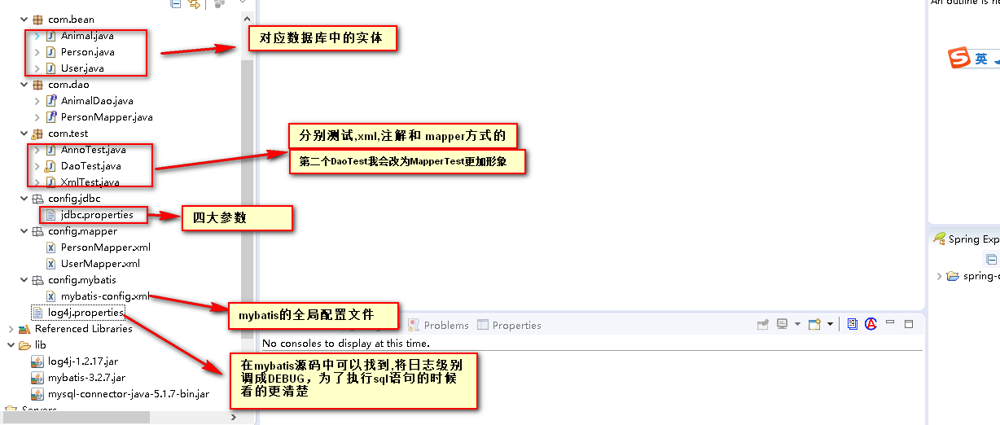

# mybatis实现增删该查三种方式的演变

## 一、案列结构图




## 1.1、从数据库设**计**

**就三张简单的表；没啥可说的；就是为了测试这三种方式**

1.user表  **为了测试xml方式**

```java
CREATE TABLE `user` (
  `id` int(11) NOT NULL AUTO_INCREMENT,
  `username` varchar(255) DEFAULT NULL,
  `age` int(11) DEFAULT NULL,
  PRIMARY KEY (`id`)
) ENGINE=InnoDB AUTO_INCREMENT=10 DEFAULT CHARSET=utf8
```

2.animal表 **为了测试注解方式**

```java
CREATE TABLE `animal` (
  `id` int(11) NOT NULL AUTO_INCREMENT,
  `name` varchar(255) DEFAULT NULL,
  `age` int(11) DEFAULT NULL,
  PRIMARY KEY (`id`)
) ENGINE=InnoDB AUTO_INCREMENT=5 DEFAULT CHARSET=utf8
```

2.person表 **为了测试Mapper代理方式**

```java
CREATE TABLE `animal` (
  `id` int(11) NOT NULL AUTO_INCREMENT,
  `name` varchar(255) DEFAULT NULL,
  `age` int(11) DEFAULT NULL,
  PRIMARY KEY (`id`)
) ENGINE=InnoDB AUTO_INCREMENT=5 DEFAULT CHARSET=utf8
```

## 二、XML方式

### 2.1、由上面的user表可以创建对应的实体类

### 2.2、创建一个xml

```xml
<?xml version="1.0" encoding="UTF-8" ?>
<!DOCTYPE mapper
  PUBLIC "-//mybatis.org//DTD Mapper 3.0//EN"
  "http://mybatis.org/dtd/mybatis-3-mapper.dtd">
  
<!--现在使用xml方式,这里只是一个包名而已  -->
<mapper namespace="config.mapper.UserMapper"> 
  <insert id="insertUser" parameterType="User">
   		insert into user(username,age) values(#{username},#{age})
  </insert>
</mapper>


```

### 2.3、注册到mybatis全局配置文件中

```xml
<mapper resource="xxx.xml"/>
```


### 2.4、测试

```java
public class XmlTest {
	public static void main(String[] args) {
		String resource = "config/mybatis/mybatis-config.xml";
		InputStream inputStream = null;
		try {
			inputStream = Resources.getResourceAsStream(resource);
		} catch (IOException e) {
			e.printStackTrace();
		}
		SqlSessionFactory factory = new SqlSessionFactoryBuilder().build(inputStream);
		SqlSession sqlSession = factory.openSession(true);//设置自动提交
		/**
		 * xml方式:不需要定义dao接口,也可以执行方法,只需定位到该xml中的方法
		 * config.mapper.UserMapper.insertUser
		 * config.mapper.UserMapper是命名空间,xml方式可以随便定义,就像包名一样,
		 * insertUser就像下面的类一样
		 */
		int count = sqlSession.insert("config.mapper.UserMapper.insertUser", new User("dyt",20));
		System.out.println(count);
	}
}

```


## 三、注解方式

### 3.1、由上面的animal表可以创建对应的实体类

### 3.2、创建一个接口(AnimalDao)


```java

public interface AnimalDao {
	
	@Insert("insert into animal(name,age) values(#{name},#{age})")
	int addAnimal(Animal animal);
	
	Animal selectById(int id);
	
	List<Animal> selectAll();
}

```

### 3.3、注册到mybatis全局配置文件中

```xml
<mapper class="com.dao.AnimalDao"/>
```

### 3.4、测试 

```java
public class AnnoTest {
	public static void main(String[] args) {
		String resource = "config/mybatis/mybatis-config.xml";
		InputStream inputStream = null;
		try {
			inputStream = Resources.getResourceAsStream(resource);
		} catch (IOException e) {
			e.printStackTrace();
		}
		SqlSessionFactory factory = new SqlSessionFactoryBuilder().build(inputStream);
		SqlSession sqlSession = factory.openSession();//可以设置自动提交
		AnimalDao animalDao = sqlSession.getMapper(AnimalDao.class);
		int count = animalDao.addAnimal(new Animal("旺财", 13));
		System.out.println(count);
		//没有设置自动提交,所以需要手动去提交!!!
		sqlSession.commit();
	}
}

```

## 四 、Mapper方式

### 4.1、由上面的person表可以创建对应的实体类

### 4.2、创建接口(PersonMapper)

```java
public interface PersonMapper {
	
	int addUser(Person person);
	
	Person selectById(int id);
	
	List<Person> selectAll();
}

```

### 4.3、创建对应的personMapper.xml文件

```xml
<?xml version="1.0" encoding="UTF-8" ?>
<!DOCTYPE mapper
  PUBLIC "-//mybatis.org//DTD Mapper 3.0//EN"
  "http://mybatis.org/dtd/mybatis-3-mapper.dtd">
  
<!--现在使用dao方式,这里必须是Dao接口的类路径 -->
<mapper namespace="com.dao.PersonMapper"> 

  <!--id必须和Dao接口中的方法一致  -->
  <insert id="addUser" parameterType="Person">
   		insert into person(name,age) values(#{name},#{age})
  </insert>
</mapper>

```

### 4.4、注册到mybatis全局配置文件中

```xml
	<mapper resource="config/mapper/PersonMapper.xml"/>
```

### 4.5、测试

```java
public class DaoTest {
	public static void main(String[] args) {
		String resource = "config/mybatis/mybatis-config.xml";
		InputStream inputStream = null;
		try {
			inputStream = Resources.getResourceAsStream(resource);
		} catch (IOException e) {
			e.printStackTrace();
		}
		SqlSessionFactory factory = new SqlSessionFactoryBuilder().build(inputStream);
		SqlSession sqlSession = factory.openSession(true);//设置自动提交
		PersonMapper dao = sqlSession.getMapper(PersonMapper.class);
		int count = dao.addUser(new Person("wzj",20));
		System.out.println(count);
	}
}

```


### 四、三种方式的比较，推荐Mapper方式  [重要！]

**mybatis实现增删改查的三种方式**

- **xml:**
  ​	1.定义一个xml,然后加载到全局配置文件<mapper resource="xxx.xml"/>
  ​	2.然后test: sqlSession.insert("config.mapper.UserMapper.insertUser", new User("dyt",20));
  ​	优点: 写sql语句比较清晰,sql与java代码分离
  ​	缺点: 调用时,这个namespace太长
- **注解:**
  ​	1.定义一个dao接口,然后也需要加载到,mybatis的全局配置文件中<mapper class="接口的类路径"/>
  ​	2.然后test,getMapper()
  ​	优点:调用方法时很方法,没有xml那么长
  ​	缺点:用注解写sql的时候不清晰,简单的增删改查还好,又是几张表一起查,那不得崩溃
  ​	

```java
通过以上分析: 发现xml 和  注解方式刚好互补,然后我们就可以取其精华,
写sql的时候还是在xml中
调用方法的时候就采用注解的那种形式 
刚好Mapper代理的写法就是这样！！！！
```
- **Mapper[推荐]**
  ​	1.定义一个接口
  ​	2.定义一个xml,xml的nameSpace必须是和接口的类路径一致
  ​	     接口中的方法,也对应标签中的id属性
  ​	3.然后注册在mybatis全局配置文件中
  ​	4.然后测试