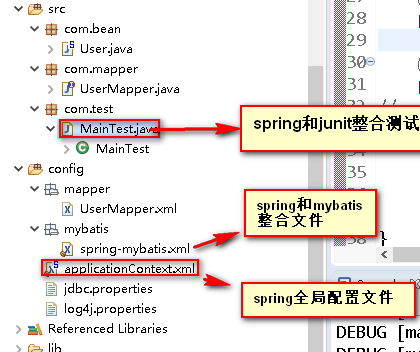
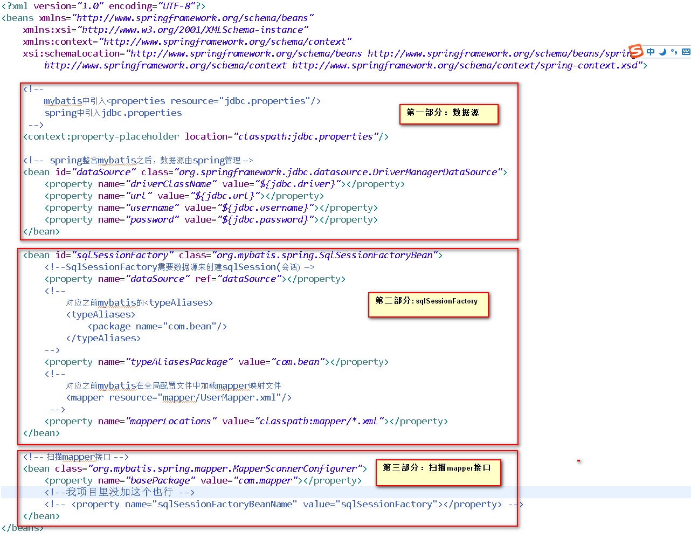

# spring 和 mybatis 整合步骤

## 一 、环境

记住使用该项目的代码必须是**JRE7环境** **否则会报错**！！！！

**BeanDefinitionStoreException: Failed to read candidate component class**

我使用的是STS和**jdk7** 编译环境

我整合是用的普通的java项目,而不是maven 项目

##  二 、准备工作

### 2.1 结构图





### 2.2一些配置文件先整好

- 需要用到的log4j.properties （mybatis文档中有,打印日志,看清sql的执行,记得里面开启**DEBUG级别**）
- 还有连接数据库的四大参数的配置（jdbc.properties）

- **spring-mybatis.xml** 



- **applicationContext.xml** 全局配置

```xml
<?xml version="1.0" encoding="UTF-8"?>
<beans xmlns="http://www.springframework.org/schema/beans"
	xmlns:xsi="http://www.w3.org/2001/XMLSchema-instance"
	xmlns:context="http://www.springframework.org/schema/context"
	xmlns:p="http://www.springframework.org/schema/p"
	xsi:schemaLocation="http://www.springframework.org/schema/beans http://www.springframework.org/schema/beans/spring-beans.xsd
		http://www.springframework.org/schema/context http://www.springframework.org/schema/context/spring-context.xsd">
	
	<!--分模块配置  -->
	<!--到入spring和mybatis整合的xml -->
	<import resource="mybatis/spring-mybatis.xml"/>
	
	<!--
		1.这个确实是扫描类上带有@compoent,@controller,@service,@repository之类的注释,然后以类首字母小写注入容器中
		2.而且还具有<context:annotation-config/>标签的功能
		 博客：https://blog.csdn.net/u010081710/article/details/77187366
	  -->
	<context:component-scan base-package="com.bean"/>

</beans>

```


### 2.3 创建一个简单的user表

```sql
CREATE TABLE `user` (
  `id` int(11) NOT NULL AUTO_INCREMENT,
  `username` varchar(255) DEFAULT NULL,
  `password` varchar(255) DEFAULT NULL,
  PRIMARY KEY (`id`)
) ENGINE=InnoDB AUTO_INCREMENT=2 DEFAULT CHARSET=utf8
```


### 2.4 创建一个对应的实体类

```java
public class User {
	private int id;
	private String name;
	private String password;
    //构造 setter/getter 自己补齐
}
```


### 2.5 创建一个mapper接口 

```java
public interface UserMapper {
	//根据用户名密码登录
	User selectByup(User user)throws Exception;
}
```


### 2.6对应的创建一个mapper.xml文件

```xml
<?xml version="1.0" encoding="UTF-8"?>
<!DOCTYPE mapper
    PUBLIC "-//mybatis.org//DTD Mapper 3.0//EN"
    "http://mybatis.org/dtd/mybatis-3-mapper.dtd">
  
<mapper namespace="com.mapper.UserMapper">
	<!--因为这里我们配置了别名扫描,所以可以写别名 -->
	<select id="selectByup" parameterType="User" resultType="int">
		select count(*) from user where username = #{username} and password = #{password}
	</select>
</mapper>
```


### 2.7测试环节

```java
//如果项目中没有junit,记得右击添加junit的库
@RunWith(SpringJUnit4ClassRunner.class)
@ContextConfiguration(locations = {"classpath:applicationContext.xml"})
public class MainTest {
	
	@Autowired
	private UserMapper mapper;
	
	//就是你没注入到容器中,所以这里获取不到
	//NoSuchBeanDefinitionException: No matching bean of type [com.bean.User] found for dependency: expected at least 1 bean which qualifies as autowire candidate for this dependency
	
	/**
	 * @Autowired 是找容器中有没有与之配对的类型
	 *      容器中有该类型,就自动匹配上了
	 */
	@Autowired
	private User user;
	
	@Test
	public void selectByupTest() throws Exception {
//		System.out.println(user);
		user.setUsername("wzj");
		user.setPassword("123");
		int  count = mapper.selectByup(user);
		System.out.println(count);
	}
}
```

### 2.8 遇到的错误

```java
spring和mybatis整合遇到的错误

错误原因：Exception in thread "main" org.springframework.beans.factory.BeanDefinitionStoreException: Failed to read candidate component class
一个是由于spring是3.2的jar,必须是jdk7的环境,jdk8还不行
博客：https://blog.csdn.net/yhl_jxy/article/details/52999571


错误原因：A query was run and no Result Maps were found for the Mapped Statement
一个是select标签中,没给resultType,更新操作就不用给
博客：https://blog.csdn.net/u013399093/article/details/53087469
```

