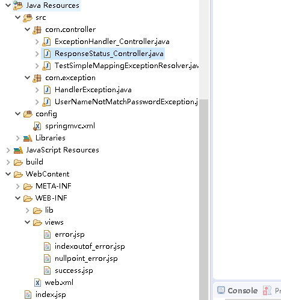
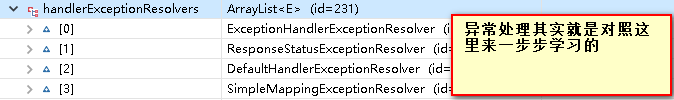

# 一、springmvc 异常

## 1.0 案例结构图



**其实异常的内容是参照如下图讲的**

使用了<mvc:annotation-driven> 才有数组第一个元素**ExceptionHandlerExceptionResolver**

默认是一个过期的ExceptionResolver,你可以通过Debug断点看



## 1.1 @ExceptionHandler注解的用法

**①：在程序中异常比较常见**

​        最常见的异常处理方法就是用`try catch`来捕捉异常。

​        这次我们使用springmvc给我们提供的方法来处理异常

```java
@Controller
public class ExceptionHandler_Controller {
	

	@ExceptionHandler(value= {ArithmeticException.class})
	public  ModelAndView handlerException(Exception ex) {
		System.out.println("出异常了：: "+ex.getMessage());
		//将异常信息显示到页面上
		ModelAndView mv = new ModelAndView("error");
		mv.addObject("exception", ex);
		return mv;
	}

	@RequestMapping("/testExceptionHandler")
	public String testExceptionHandler(@RequestParam("i") Integer i) {
		System.out.println("result: "+ 10 / i);
		return "success";
	}
}
```

 @ExceptionHandler 的value 属性是一个Class数组，因此你可以在里面放多个异常类

上面代码的意思就是：

只要在这个类里面发生了ArithmeticException异常；就会由带了

@ExceptionHandler(value= {ArithmeticException.class}) 这个方法给捕获 


**② 测试**

例如：访问 localhost:8080/testExceptionHandler?i=0  这样就会发生异常


**③ 异常信息想在页面上显示怎么办？**

1. 可以把Exception对象存入到ModelAndView中；就是默认会放到Request域中然后从页面中取出，**注意存入Map中是会报错的！！**
2. 可以将错误页面的isErrorPage="true"；然后${exception} 好像也是可以取出来异常信息的


**④ HandleException的优先级**

当一个controller中有多个HandleException注解出现时，那么异常被哪个方法捕捉呢？

这就存在一个优先级的问题；

**当然越精确的优先啊！！！**


## 1.2、捕获全局异常之@controllerAdvice

**①使用 @ControllerAdvice注解； 一定要加上<mvc:annotation-driven/>**

② ExceptionHandler只能捕捉同一个controller中的异常，其实我们也有办法捕捉整个程序中所有的异常；新建一个类，加上@ControllerAdvice注解

```java
@ControllerAdvice
public class HandlerException {

	@ExceptionHandler(value= {ArithmeticException.class})
	public ModelAndView testExceptionHandler(Exception ex) {
		ModelAndView mv = new ModelAndView("error");
		//将Exception存到model中 在页面显示
		mv.addObject("exception", ex);
		return mv;
	}
}
```


## 1.3、异常处理之@ResponseStatus

① 带有 **@ResponseStatus** 注解的类会被ResponseStatusExceptionResolver解析

​     有两个属性 value: 是http状态码  reason: 是错误原因

② **@ResponseStatus修饰类上**

```java
@ResponseStatus(value=HttpStatus.FORBIDDEN,reason="用户名和密码不匹配")
public class UserNameNotMatchPasswordException extends RuntimeException{

}
```

测试代码

```java
@RequestMapping("/testResponseStatus")
	public String testResponseStatus(@RequestParam("i") Integer i) {
		if(i == 10) {
			//如果这里抛出了异常就不会往下执行
			throw new UserNameNotMatchPasswordException();
		}
		System.out.println("testResponseStatus");
		return "error";
	}
```


③ **@ResponseStatus修饰方法上**

```java
/**
		@ResponseStatus在方法上面修饰
		无论该方法中是否有异常，都会返回一个你指定的异常页面是：内容为你指定的				         HttpStatus.FORBIDDEN,reason="测试@ResponseStatus在方法上
		如果没有异常的话，那条输出语句是会执行的 ！！！
	 */
	@ResponseStatus(value=HttpStatus.FORBIDDEN,reason="测试@ResponseStatus在方法上")
	@RequestMapping("/testResponseStatus2")
	public String testResponseStatus2(@RequestParam("i") Integer i) {
		if(i == 10) {
			//如果这里抛出了异常就不会往下执行
			throw new UserNameNotMatchPasswordException();
		}
		System.out.println("testResponseStatus2");
		return "error";
	}
```


## 1.4、全局处理异常SimpleMappingExceptionResolver

① 在springmvc中配置

```xml
<bean class="org.springframework.web.servlet.handler.SimpleMappingExceptionResolver">
		<!-- 
			配置异常的属性值为ex，那么在错误页面中可以通过 ${ex} 来获取异常的信息
    		 如果不配置这个属性，它的默认值为exception
		 -->
		<property name="exceptionAttribute" value="ex"></property>
		<property name="exceptionMappings">
			<props>
				<!-- 映射NullPointerException异常对应nullpoint_error.jsp这个页面 -->
				<prop key="java.lang.NullPointerException">nullpoint_error</prop>
				<prop key="java.lang.ArrayIndexOutOfBoundsException">indexoutof_error</prop>
			</props>
		</property>
	</bean>
```

