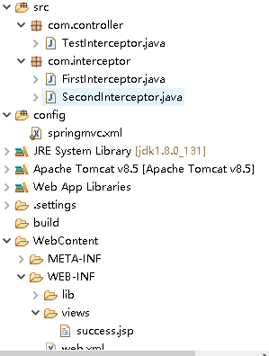
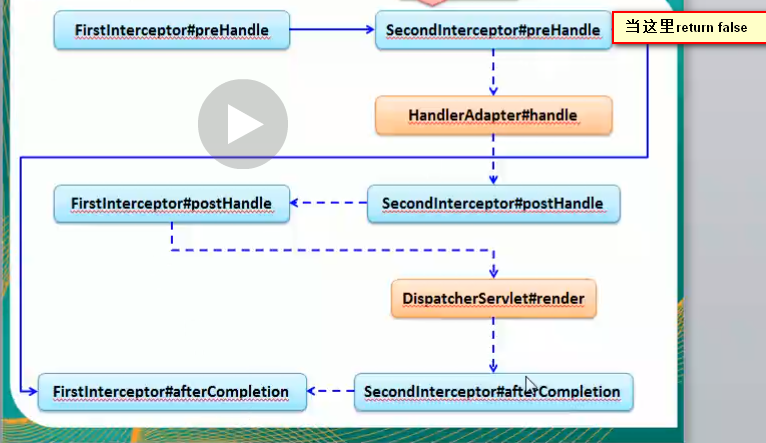

# 一、springmvc拦截器

## 1.0、案例结构图



## 1.1、自定义拦截器

① 写一个自定义类实现 **HandlerInterceptor** 接口

```java
public class FirstInterceptor implements HandlerInterceptor{
	
	/**
	 	目标方法执行之前执行
	 	如果返回值为false, 则不会调用后续的拦截器和目标方法
	 	如果返回值为true, 则继续调用后续的拦截器和目标方法
	 	可以用于权限，日志，事务等
	 */
	@Override
	public boolean preHandle(HttpServletRequest arg0, HttpServletResponse arg1, Object arg2) throws Exception {
		System.out.println("【FirstInterceptor】 preHandle" );
		return true;
	}
	
	/**
	 	目标方法执行之后，视图渲染之前执行
	 	可以对请求域中的属性或试图做出修改【因为参数有个ModelAndView】
	 */
	@Override
	public void postHandle(HttpServletRequest arg0, HttpServletResponse arg1, Object arg2, ModelAndView arg3)
			throws Exception {
		System.out.println("【FirstInterceptor】 postHandle" );
		
	}

	/**
	  	渲染试图之后被调用
	 	用于释放资源
	 */
	@Override
	public void afterCompletion(HttpServletRequest arg0, HttpServletResponse arg1, Object arg2, Exception arg3)
			throws Exception {
		System.out.println("【FirstInterceptor】 afterCompletion" );
	}

}
```


② 然后在springmvc的配置文件中配置一下就生效了

```xml
	<!--配置拦截器  -->
	<mvc:interceptors>
		<!--可以直接写bean节点   -->
		<bean class="com.interceptor.FirstInterceptor"></bean>
	</mvc:interceptors>
```


## 1.2、拦截器的配置

①  在自定义一个拦截器(**SecondInterceptor**) 实现**handlerInterceptor**接口

②  在springmvc 的配置如下
```xml 
<mvc:interceptors>
    <!--可以直接写bean节点   -->
    <bean class="com.interceptor.FirstInterceptor"></bean>
    <mvc:interceptor>
     <!--这个拦截器只拦截/path请求,而上面FirstInterceptor全部拦截-->
        <mvc:mapping path="/hello"/>
        <bean class="com.interceptor.SecondInterceptor"></bean>
    </mvc:interceptor>
</mvc:interceptors>
```

在<mvc:interceptors>标签下可以直接写bean标签设定拦截器

也可以使用<mvc:interceptor> 标签更精确的配置


## 1.3、拦截器的顺序

① 我点击hello链接的时候；两个拦截器都会触发；执行顺序如下

```java
【FirstInterceptor】 preHandle
【SecondInterceptor】 preHandle
 hello 目标方法
【SecondInterceptor】 postHandle
【FirstInterceptor】 postHandle
【SecondInterceptor】 afterCompletion
【FirstInterceptor】 afterCompletion
```

他这个顺序是怎么执行的呢？

是去看配置文件中interceptor的顺序，由于我在<mvc:interceptors>标签中

将FirstInterceptor配置在前面，所以FirstInterceptor --》SecondInterceptor属于正序

参照这点，方法如下执行

preHandle 正

postHandle  反

afterCompletion 反

**这种规律是我们总结出来的，其实是在源码中可以看到的 ，只是由于水平不够，没去深究**

**注意**：**只有两个拦截器的preHandle方法的返回值是true才是这种执行顺序**

---


② 如果场景是 **FirstInterceptor 的 preHandle 方法的返回值是false** , 执行如下

```java
【FirstInterceptor】 preHandle
```

----


③ 如果场景是 **SecondInterceptor的 preHandle 方法的返回值是false** , 执行如下

```java
【FirstInterceptor】 preHandle
【SecondInterceptor】 preHandle
【FirstInterceptor】 afterCompletion
```

因为**SecondInterceptor的 preHandle 方法返回是false** 的时候就不会调用后续的拦截器和目标方法了， 连目标方法都不会去调用了， 你怎么执行postHandle啊 ，因为postHandle 后面才调用啊



